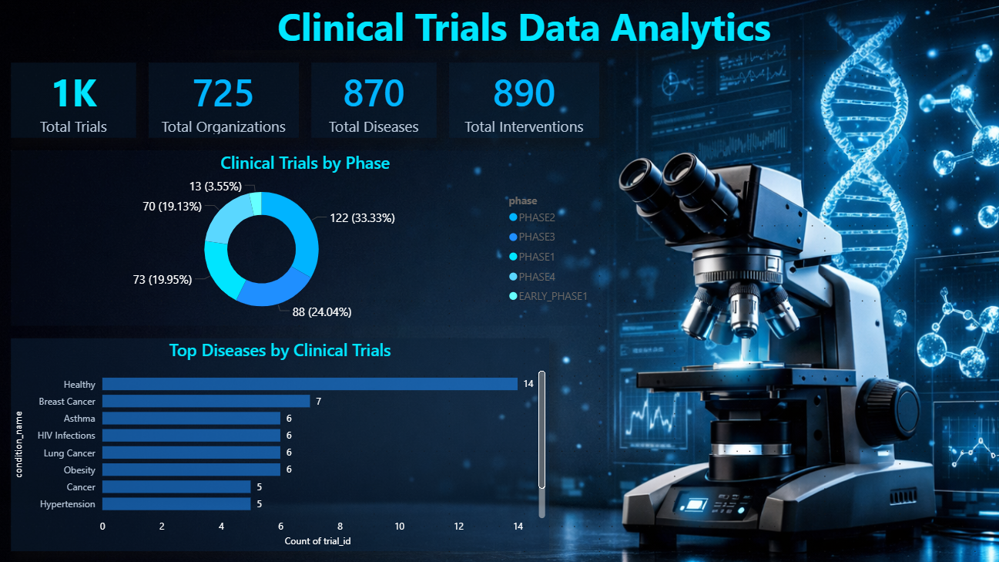
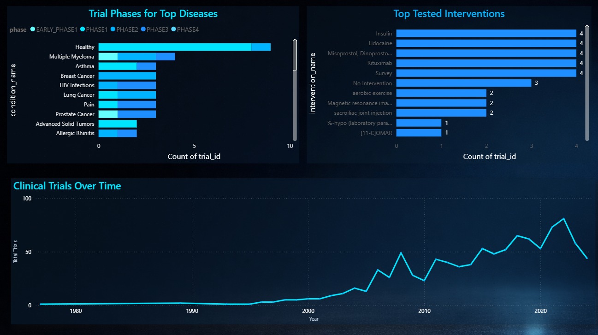
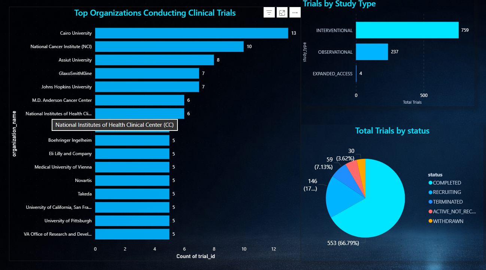

# Clinical Trials Data Analytics

An end-to-end **Data Analytics project** exploring global clinical research activity using **PostgreSQL, SQL, and Power BI**.

This project demonstrates the complete analytics pipeline:

Clinical Trials Dataset → Data Cleaning → PostgreSQL ETL → SQL Analysis → Power BI Dashboard

---

# Project Overview

The healthcare industry produces massive amounts of clinical research data. Thousands of clinical trials are conducted globally to evaluate new drugs, treatments, and medical interventions.

This project focuses on transforming raw clinical trial data into a structured relational database and extracting meaningful insights about global clinical research activity.

The analysis helps identify:

- organizations conducting the most clinical trials
- diseases receiving the most research attention
- distribution of clinical trials across phases
- most commonly tested medical interventions
- trends in global clinical research

---

# Project Architecture

Clinical Trials Dataset  
↓  
PostgreSQL Staging Table  
↓  
ETL Transformation Pipeline  
↓  
Normalized Relational Database  
↓  
SQL Analysis  
↓  
Power BI Dashboard

---

# Database Schema
- organizations
- trials
- conditions
- interventions
- trial_conditions
- trial_interventions
The dataset was normalized into the following relational tables:

This structure eliminates data duplication and enables efficient relational analysis.

---

# SQL Implementation

The database schema and ETL pipeline are implemented in:
- clinical_trials_db.sql
  

This file includes:

- table creation
- staging table
- ETL transformation
- analytical SQL queries

---

# Dataset

Source: **ClinicalTrials.gov**

The full dataset contains approximately **496,000 clinical trial records**.

Due to GitHub file size limitations, the raw dataset is not included in this repository.

A smaller subset of **1000 rows** was used for development and demonstration purposes.

---

# Power BI Dashboard

The project includes a **multi-page interactive dashboard**.

---

## Page 1 — Clinical Research Overview

Displays high-level insights including:

- total clinical trials
- research organizations
- disease analysis
- clinical trial phases
- study types

---

## Page 2 — Disease & Intervention Analysis

Focuses on medical research trends:

- most studied diseases
- most tested interventions
- clinical trial phases for top diseases

---

## Page 3 — Organization Research Activity

Analyzes organizations conducting clinical trials:

- top research organizations
- trials by study type
- research activity insights

---

# Technologies Used

- PostgreSQL
- SQL
- Power BI
- ClinicalTrials.gov Dataset

---

# Key Insights

The analysis reveals:

- organizations leading global clinical research
- diseases receiving the most research investment
- distribution of clinical trials across phases
- most frequently tested treatments
- trends in medical research activity

---

# Skills Demonstrated

- SQL data modeling
- ETL pipeline development
- relational database design
- analytical SQL queries
- Power BI dashboard development
- data visualization and storytelling

---

# Author

Omkar Udawant
